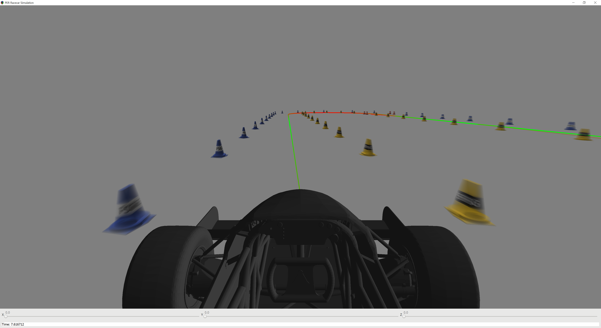
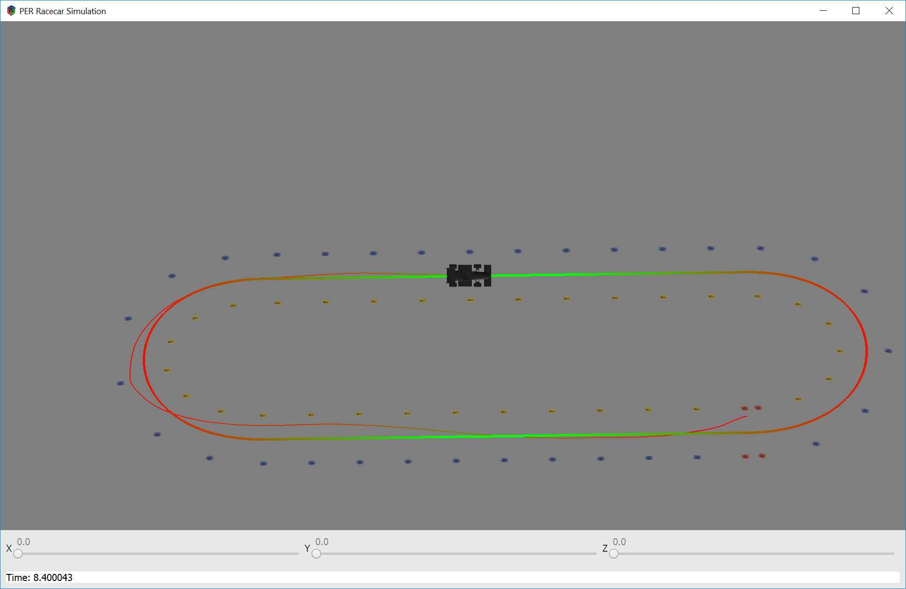

# Racecar-MPC-Simulation

A racecar simulation that I created for two different final projects for two classes I took in Fall of 2018. One was a control systems class (MEAM517) and the other was machine learning (CIS519) and both had final projects where we could pick anything relevant we wanted. I'm the software lead of [Penn Electric Racing](http://pennelectricracing.com), a student organization that designs, builds and races custom electric racecars, and we've been thinking about competing in the driverless division at some point, so this seemed like a great opportunity to get started on the project. Even if we don't, it was a great learning experience and hopefully other teams will find it useful. I developed the physics model and used it to develop a Model Predictive Control algorithm to get the racecar to follow a path for MEAM517. The CIS519 project involved using Neural Networks to find cones in images with motion blur and I used the simulation to generate the training and test data. It was a group project and I'm not including the machine learning portion of the code.

# Project Results Summary
The simulated racecar can successfully follow different courses, but there's still a lot of room for tuning. The code nearly runs in real time but it isn't quite fast enough and the racecar doesn't follow the path as well as I'd like. The neural network we produced for the machine learning project was able to locate cones in the test dataset within an average positional error of 1.2m. The simulation doesn't include pitch and roll yet though and I expect that to reduce the accuracy. I tried to make everything as realistic as was feasible and I'm really curious to see how will the approaches to both problems will work on a real vehicle.

# Controls
* p - Pauses the simulation
* Space bar - Top down view
* `+` - zoom in
* `-` - zoom out
* To enable keyboard control (disabling MPC), change the boolean at the beginning of [Simulation.cpp](https://github.com/jayhf/Racecar-MPC-Simulation/blob/84144539ba90640759cfac7ce4dcfcf31769f184/Simulation.cpp#L13)
* ↑ - Maximum acceleration (all wheels) - may want to edit the code to tune this depending on the course
* ↓ - Maximum deceleration (all wheels)
* Move mouse left and right to steer

# Files
* [RacecarMPC.pdf](RacecarMPC.pdf) - My report for MEAM517. Read this for more details on the implementation and results.
* [CMakeLists.txt](CMakeLists.txt) - CMake build file. See below for information on building the project
* [GlModel.hpp](GlModel.hpp)/[.cpp](GlModel.cpp) - Class for easily loading 3D models into a format usable with OpenGL using ASSIMP.
* [OpenGlWrappers.hpp](OpenGlWrappers.hpp)/[.cpp](OpenGlWrappers.cpp) - RAII classes for managing OpenGL resources to simplify loading shaders and avoiding resource leaks.
* [Path.hpp](Path.hpp)/[.cpp](Path.cpp) - A class hierarchy for working with paths made of several types of primitives and trajectories that determine the optimal speed for the racecar to go along the path
* [RaceWindow.hpp](RaceWindow.hpp)/[.cpp](RaceWindow.cpp) - gtkmm window class that does most of the rendering and user interaction 
* [RgbImage.hpp](RgbImage.hpp)/[.cpp](RgbImage.cpp) - A class for saving and loading images and for OpenGL textures and screenshots 
* [Simulation.hpp](Simulation.hpp)/[.cpp](Simulation.cpp) - A set of classes that handle updating the simulation, including doing the physics calculations and MPC. The course and simulation can be changed at the end in [create_simulation](https://github.com/jayhf/Racecar-MPC-Simulation/blob/84144539ba90640759cfac7ce4dcfcf31769f184/Simulation.cpp#L1233) and a variety of parameters can be adjusted at the beginning of the file.
* [main.cpp](main.cpp) - Starts the simulation
* [any_color.vs](any_color.vs)/[.fs](any_color.fs) - Shaders for drawing with no lighting and each vertex having a specified color. Linear interpolation is used for colors in between.
* [cone.vs](cone.vs)/[.fs](cone.fs) - Shaders for drawing cones with stripes and directional lighting
* [solid_color.vs](solid_color.vs)/[.fs](solid_color.fs) - Shaders for drawing something with a uniform color

# Building this project
0. Clone this repository
1. Install GCC (on Windows, install MSYS2 first and install gcc within MSYS2)
2. Install CMake
3. Install the required libraries (gtkmm, OpenGL, libjpeg, GLEW, GLM, ASSIMP, Eigen, and Gurobi). Note: Gurobi is paid software, but offers free Academic licenses. You can also comment out the code that uses it and still run the simulation, but without MPC.
4. Three resource files aren't included for the cone model, car model and cone stripe image. Create any valid replacement files and update the lines at the top of [RaceWindow.cpp](/RaceWindow.cpp) accordingly.
5. Build the project with CMake. If not on Windows or if your Gurobi version isn't 8.1, update line 40 in [CMakeLists.txt](/CMakeLists.txt). Note that this was developed on Windows within a larger project, so there may be minor configuration issues you have to fix depending on your platform.
